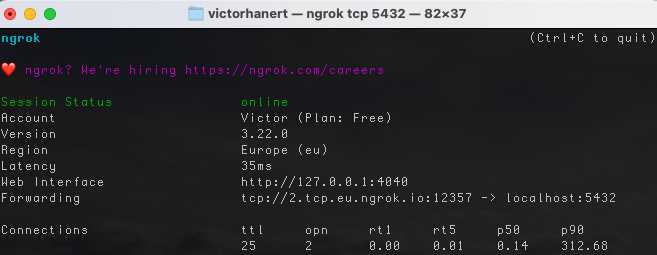
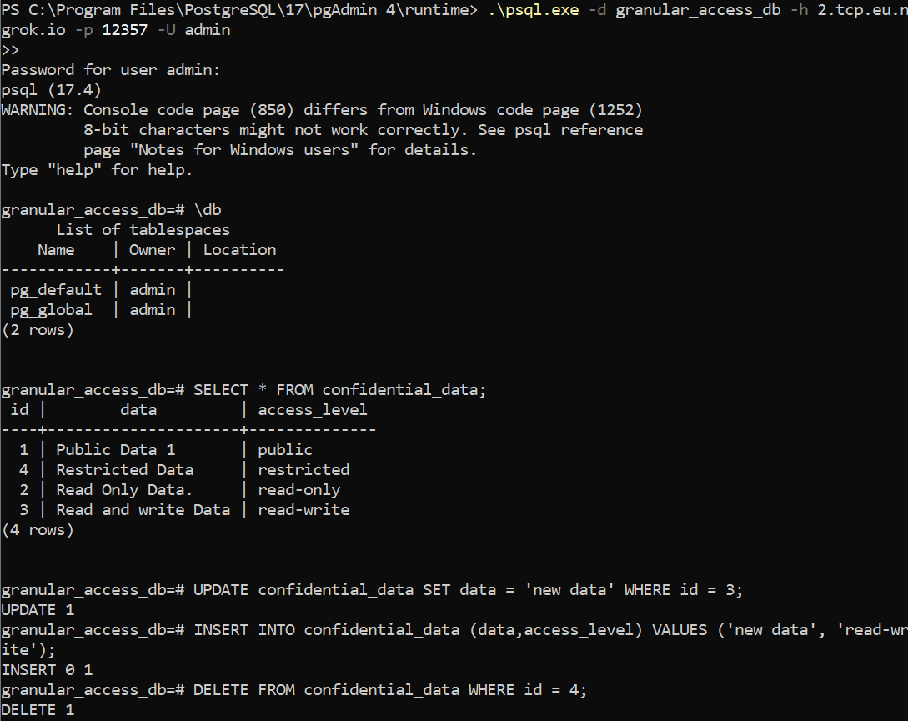
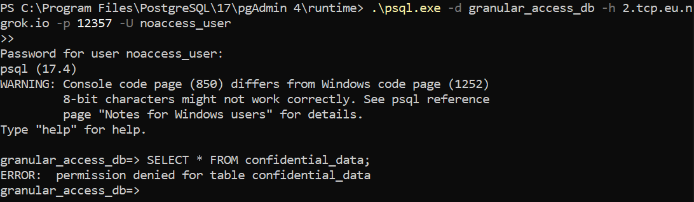
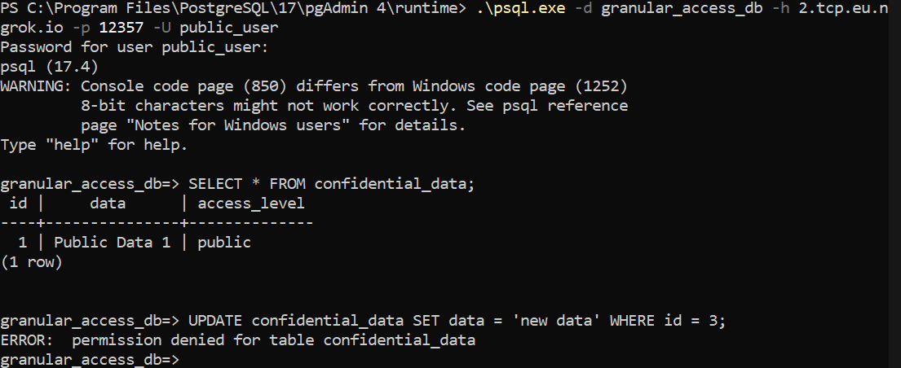
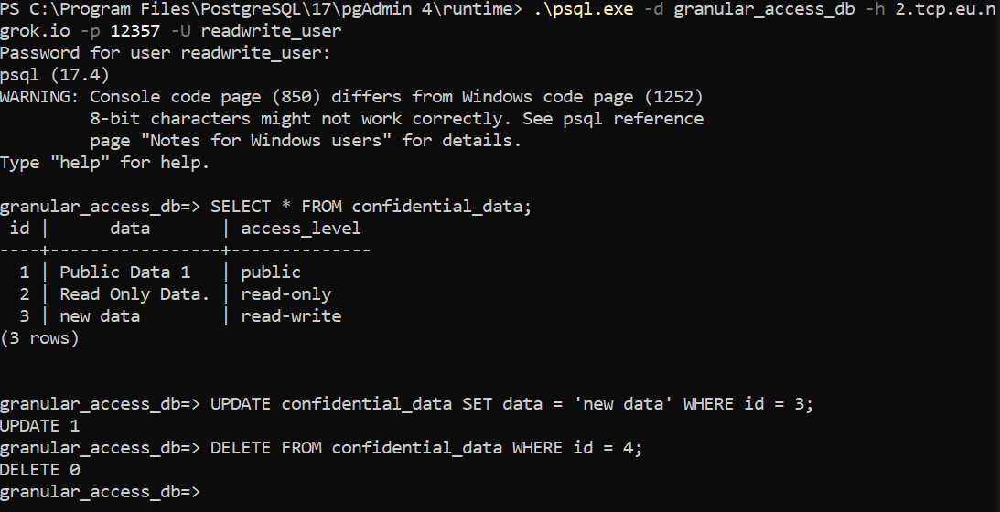

This screenshot shows the Ngrok terminal output indicating that the database is accessible via a public URL. This URL and port need to be shared with the integrator for accessing the PostgreSQL database remotely.  

You can see the total number of connections and the current connections to the database.

This screenshot illustrates the `admin` user accessing the PostgreSQL database with full permissions, allowing the user to read, write, and manage all data in the `confidential_data` table.  

This screenshot shows the `noaccess_user` attempting to access the `confidential_data` table but being denied access due to the lack of permissions.  

This screenshot shows the `public_user` accessing the `confidential_data` table. The user can only see the data labeled as 'public' due to the Row-Level Security (RLS) policies set up in the PostgreSQL database.  

This screenshot demonstrates the `readwrite_user` accessing the `confidential_data` table. The user can read and write specific data as defined by the RLS policies.  
