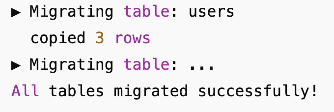

## Formål
Migrer brugerdata fra én PostgreSQL-database til MySql ved hjælp af Node.js og Knex.js.

1. Docker og Docker Compose installeret.
2. Node.js (v16+) og `npm` installeret.

## Struktur
- `.env.source` – kilde‐Postgres (port 5433)
- `.env.mysql` – mål‐MySQL (port 3306)
- `docker-compose.yml` – starter begge databaser
- `src/migrate.js` – script til at migrere alle tabeller

## Start databaserne
docker-compose down -v
docker-compose up -d

## Seed testdata:
npx knex seed:run --env source

# Run migration
npm run migrate

## Eksempel på migration
